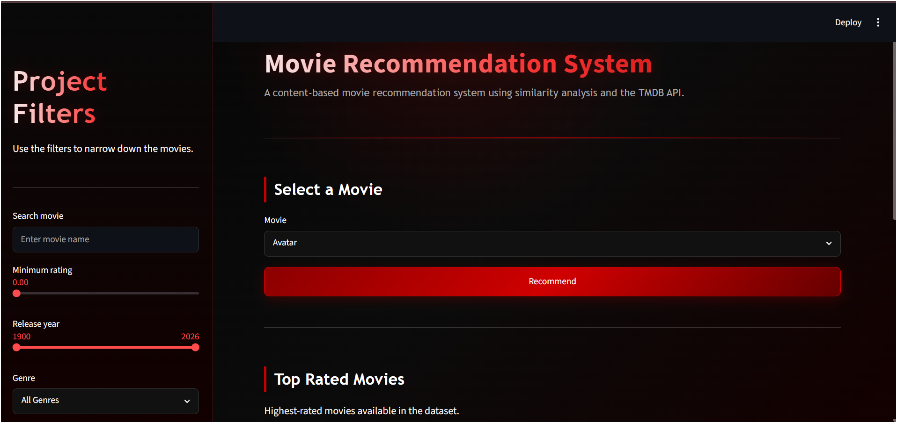
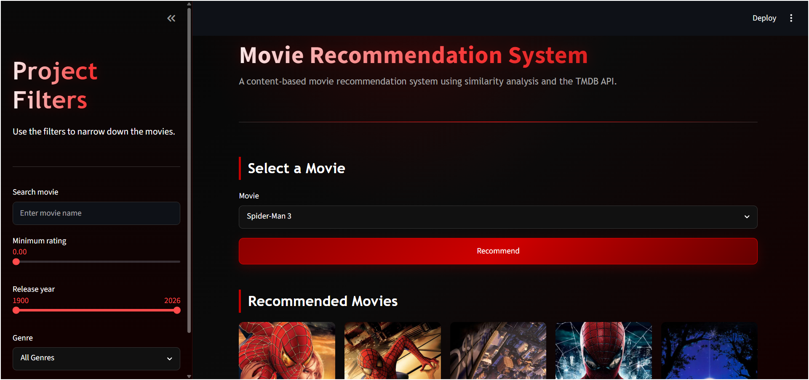
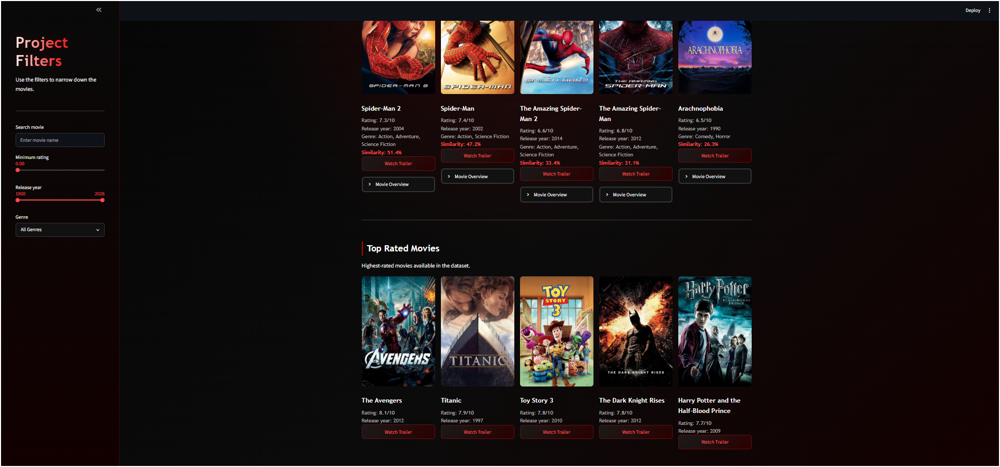
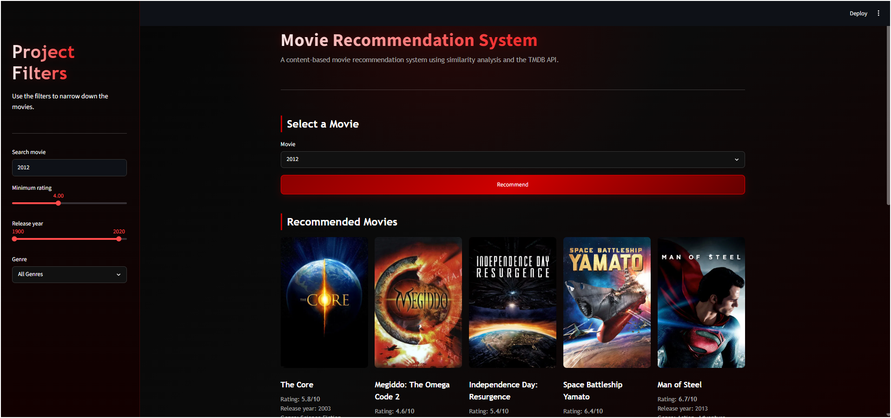
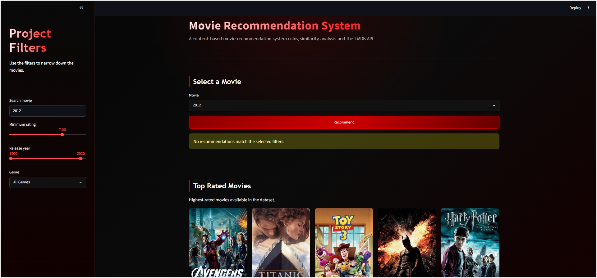

# 🎬 Movie Recommendation System

A machine learning based web application that recommends movies similar to a selected movie based on movie metadata.

The recommendation system is built using **Content-Based Filtering**, **CountVectorizer**, and **Cosine Similarity**, and deployed using **Streamlit**.

---

## 📌 Project Overview

Movie recommendation systems help users discover movies based on the characteristics of movies they already like.

This project builds an end-to-end **Content-Based Movie Recommendation System** using movie metadata such as:

* Movie Overview
* Genres
* Keywords
* Top 3 Cast Members
* Director

These features are combined into a single text-based feature called `tags`.

The `tags` feature is then processed using NLP techniques and converted into numerical vectors using **CountVectorizer**.

Finally, **Cosine Similarity** is used to calculate the similarity between movies.

When a user selects a movie, the system finds movies with the highest similarity scores and recommends the **Top 5 similar movies**.

The project also integrates the **TMDB API** to display dynamic movie information such as posters, ratings, release year, genres, overview, and trailers.

---

## 🖥️ Application Preview

The Movie Recommendation System provides an interactive Streamlit interface where users can select a movie and receive similar movie recommendations.

The application also provides:

* Movie posters
* Movie ratings
* Release year
* Movie genres
* Movie overview
* Movie trailers
* Minimum rating filter
* Release year filter
* Genre filter
* Movie search
* Top-rated movie section
* Filtered recommendation results

### 🏠 Main Application

### 🎬 Movie Recommendations

### ⭐ Top Rated Movies

### 🔍 Project Filters

### ⚙️ Filtered Results

---

## 🎯 Problem Statement

A large number of movies are available on streaming and entertainment platforms, making it difficult for users to discover movies that match their interests.

The objective of this project is to build a recommendation system that can:

1. Understand important characteristics of movies.
2. Represent movies using their metadata.
3. Measure similarity between movies.
4. Recommend movies similar to a movie selected by the user.
5. Display useful movie information through an interactive web application.

---

## 🎯 Project Objectives

The main objectives of this project are:

1. Load and preprocess the TMDB movie datasets.
2. Combine movie and credits information.
3. Extract useful movie metadata.
4. Perform feature engineering.
5. Create a combined `tags` feature.
6. Apply NLP preprocessing.
7. Apply Porter Stemming.
8. Convert movie tags into numerical vectors using CountVectorizer.
9. Calculate movie similarity using Cosine Similarity.
10. Generate the Top 5 similar movie recommendations.
11. Integrate the TMDB API for dynamic movie information.
12. Build an interactive Streamlit application.
13. Provide filtering options such as rating, year, and genre.

---

## 🤖 Machine Learning Model

### Content-Based Filtering

This project uses a **Content-Based Filtering Recommendation System**.

Content-Based Filtering recommends items based on the similarity of their characteristics.

In this project, the system does not depend on user-rating history. Instead, it compares the metadata of movies.

For example, if a movie contains information related to:

`Action + Science Fiction + Space + Adventure + Christopher Nolan`

then movies having similar metadata will receive higher similarity scores.

### Why Content-Based Filtering?

Content-Based Filtering is suitable for this project because the available dataset contains rich movie metadata such as:

* Overview
* Genres
* Keywords
* Cast
* Director

These features can be transformed into a textual representation and compared using similarity measures.

---

## 🧩 Features Used for Recommendation

The following movie features are used:

### 1. Movie Overview

The overview contains a textual description of the movie story.

It provides important information about the movie's theme and storyline.

### 2. Genres

Genres describe the type of movie, such as:

* Action
* Comedy
* Drama
* Adventure
* Science Fiction

Genres help identify movies belonging to similar categories.

### 3. Keywords

Keywords provide additional information about important concepts or topics associated with the movie.

### 4. Top 3 Cast Members

The project extracts the first three cast members.

This helps the system identify movies that share important actors.

### 5. Director

The director information is extracted from the crew data.

Movies directed by the same person can therefore receive higher similarity based on the metadata representation.

---

## 🔗 Feature Engineering

The selected features are combined into one feature called `tags`.

The overall representation is:

`Overview + Genres + Keywords + Top 3 Cast + Director → Tags`

For example:

`overview + action adventure + space mission + actor1 actor2 actor3 + director`

becomes one combined text representation.

This allows different types of movie metadata to be processed together using NLP techniques.

---

## 📝 Text Preprocessing

Before converting the movie tags into numerical vectors, text preprocessing is performed.

The main steps are:

* Lowercase conversion
* Tokenization
* Stop-word removal
* Porter Stemming

The project uses `PorterStemmer()` from **NLTK** for stemming.

### Lowercase Conversion

All text is converted into lowercase so that words with different capitalization are treated consistently.

For example:

`Action → action`

### Tokenization

The text is divided into individual words or tokens.

### Stop-Word Removal

Common English words that usually provide less useful information are removed using the English stop-word list.

### Porter Stemming

The project uses **PorterStemmer** from NLTK.

Stemming converts related words into a common root form.

This helps reduce unnecessary differences between related words.

---

## 🔢 Feature Vectorization

After preprocessing, the movie tags are converted into numerical vectors using **CountVectorizer**.

The project uses:

`CountVectorizer(max_features=5000, stop_words='english')`

### What CountVectorizer Does

CountVectorizer creates a vocabulary from the movie tags and represents each movie as a numerical vector based on word occurrence.

For example:

`Movie A → [1, 0, 2, 0, 1, ...]`

`Movie B → [1, 1, 0, 0, 1, ...]`

The vectors allow mathematical similarity calculations between movies.

### Why CountVectorizer?

CountVectorizer provides a simple Bag-of-Words representation that is suitable for this metadata-based recommendation approach.

The current implementation specifically uses **CountVectorizer**, not TF-IDF.

---

## 📐 Cosine Similarity

After converting the movie tags into numerical vectors, **Cosine Similarity** is used to measure similarity between movies.

The implementation uses:

`cosine_similarity(vectors)`

Cosine Similarity measures the angle between two vectors.

A higher similarity score means that the movie metadata representations are more similar.

The similarity values are used to rank movies and generate recommendations.

---

## 🧮 Similarity Matrix

Cosine Similarity is calculated between the movie vectors to create a **movie-to-movie similarity matrix**.

Conceptually:

`Movie A → Movie B = Similarity Score`

`Movie A → Movie C = Similarity Score`

`Movie A → Movie D = Similarity Score`

When the user selects Movie A, the system looks at the similarity scores associated with Movie A, sorts them, and selects the most similar movies.

The resulting similarity matrix is saved as:

`similarity.pkl`

This file is used by the Streamlit application during recommendation.

---

## 🔄 Complete Machine Learning Workflow

The complete machine learning workflow is:

`TMDB Movies Dataset + TMDB Credits Dataset → Merge the Datasets → Select Required Features → Handle Missing Values → Extract Genres → Extract Keywords → Extract Top 3 Cast Members → Extract Director → Create Combined Tags → Convert Text to Lowercase → Text Preprocessing → Porter Stemming → CountVectorizer → Numerical Movie Vectors → Cosine Similarity → Similarity Matrix → Top 5 Similar Movies → TMDB API → Streamlit Web Application`

---

## 🗂️ Dataset

The project uses the **TMDB 5000 Movies Dataset**.

Two datasets are used:

* `tmdb_5000_movies.csv`
* `tmdb_5000_credits.csv`

Both datasets provide complementary information required to create the movie representation.

---

## 🎞️ TMDB Movies Dataset

The `tmdb_5000_movies.csv` dataset contains movie-level information.

Important information includes:

* Movie ID
* Movie title
* Movie overview
* Genres
* Keywords
* Other movie metadata

The movie dataset provides the main descriptive information required for building the recommendation features.

---

## 🎭 TMDB Credits Dataset

The `tmdb_5000_credits.csv` dataset contains information related to:

* Cast
* Crew
* Director

The credits dataset is required because important recommendation features such as the top cast members and director are available through the credits information.

---

## 🔗 Dataset Merging

The movie and credits datasets are combined using the movie title.

The purpose of merging the datasets is to create a single dataset containing both:

* Movie-level information
* Cast and crew information

After merging, the project selects the features required for recommendation.

The final selected information includes:

`movie_id, title, overview, genres, keywords, cast, crew`

From these fields, the project extracts the required genres, keywords, top cast members, and director.

---

## 🧹 Data Preprocessing

The project performs several preprocessing operations before creating the recommendation model.

The main steps include:

* Selecting required columns
* Removing rows with missing values
* Converting structured string information into Python objects
* Extracting genres
* Extracting keywords
* Extracting the top 3 cast members
* Extracting the director from crew information
* Combining the selected features
* Creating the final `tags` feature

The structured metadata is processed using Python techniques such as `ast.literal_eval`.

---

## 📋 Dataset Features

| Feature | Description | Role in Recommendation |
|---|---|---|
| `movie_id` | Unique movie identifier | Identifies the movie |
| `title` | Movie title | Used for movie selection |
| `overview` | Description of movie story | Provides textual movie information |
| `genres` | Movie genres | Represents movie category |
| `keywords` | Important movie-related keywords | Represents movie topics |
| `cast` | Movie cast information | Helps identify movies with similar actors |
| `crew` | Movie crew information | Used to extract director |
| `tags` | Combined metadata | Main feature used for recommendation |

---

## 📊 Why These Dataset Features Were Selected

The features were selected because each provides a different type of information about a movie.

* **Overview** provides story and theme information.
* **Genres** describe the movie category.
* **Keywords** provide specific topics and concepts.
* **Cast** captures important actor information.
* **Director** provides information about the movie's creative direction.

Combining these features creates a richer representation of each movie than using only one feature.

---

## 📊 Recommendation Process

When the user selects a movie, the application follows this process:

1. The selected movie title is identified.
2. The movie's position in the processed dataset is obtained.
3. The corresponding row from the similarity matrix is retrieved.
4. Similarity scores are sorted in descending order.
5. The selected movie itself is excluded.
6. The Top 5 similar movies are selected.
7. Additional information is retrieved through TMDB API.
8. The recommendations are displayed in Streamlit.

### Recommendation Workflow

`User Selects Movie → Find Movie Index → Retrieve Similarity Scores → Sort Scores → Select Top 5 → Fetch TMDB Details → Display Recommendations`

---

## 🖥️ Application Features

The Streamlit application provides:

* Movie selection
* Top 5 movie recommendations
* Movie posters
* Movie ratings
* Release year
* Movie genres
* Movie overview
* Movie trailers
* Minimum rating filter
* Release year filter
* Genre filter

---

## 🔑 TMDB API Integration

The TMDB API is used to retrieve dynamic movie information.

The application can retrieve:

* Movie posters
* Movie ratings
* Release year
* Genres
* Movie overview
* YouTube trailers

The API integration separates the recommendation logic from the dynamic presentation information.

The recommendation engine uses the locally stored processed data and similarity matrix, while the API provides additional movie details for the interface.

---

## ⚡ API Optimization

The application uses caching to reduce repeated TMDB API requests.

Movie details and trailer information are cached for a period of time.

The application also uses retry handling for temporary HTTP errors such as:

`429, 500, 502, 503, 504`

This improves the reliability of API requests.

---

## 🔐 API Key Security

The TMDB API key is stored in Streamlit secrets.

The configuration file is:

`.streamlit/secrets.toml`

The API key should never be uploaded to GitHub.

The `.gitignore` file excludes the secrets file from version control.

---

## 💾 Pickle Files

The machine learning pipeline generates pickle files used by the application.

### `movies.pkl`

Stores the processed movie dataset.

### `movie_dict.pkl`

Stores the processed movie information in dictionary format.

### `similarity.pkl`

Stores the movie-to-movie cosine similarity matrix.

The Streamlit application uses these files to load the processed recommendation data.

**Important:** `similarity.pkl` is not included in the GitHub repository because its file size is greater than GitHub's standard 100 MB file limit.

It can be generated again by running the machine learning notebook.

---

## 🧠 Generating `similarity.pkl`

Open the Jupyter Notebook:

`Movie_Recommender_System.ipynb`

Run the notebook from the beginning.

The notebook performs:

`Data Loading → Data Preprocessing → Feature Engineering → Tags Creation → Text Preprocessing → Stemming → CountVectorizer → Cosine Similarity → Save Pickle Files`

The generated files are:

* `movies.pkl`
* `movie_dict.pkl`
* `similarity.pkl`

---

## 📁 Project Structure

`Movie-Recommendation-System/`

`├── app_file.py`

`├── Movie_Recommender_System.ipynb`

`├── movie_dict.pkl`

`├── movies.pkl`

`├── tmdb_5000_movies.csv`

`├── tmdb_5000_credits.csv`

`├── requirements.txt`

`├── README.md`

`└── .gitignore`

`similarity.pkl` is generated locally by the Jupyter Notebook and is excluded from GitHub because its file size is approximately 176 MB, which exceeds GitHub's standard 100 MB file limit.

### File Description

| File | Description |
|---|---|
| `app_file.py` | Streamlit web application |
| `Movie_Recommender_System.ipynb` | Data preprocessing and ML workflow |
| `movie_dict.pkl` | Processed movie dictionary |
| `movies.pkl` | Processed movie dataset |
| `tmdb_5000_movies.csv` | Movie metadata |
| `tmdb_5000_credits.csv` | Cast and crew metadata |
| `requirements.txt` | Python dependencies |
| `.gitignore` | Files excluded from Git |

---

## 🛠️ Technologies Used

* **Python** — Main programming language
* **NumPy** — Numerical operations
* **Pandas** — Data loading and manipulation
* **Scikit-learn** — CountVectorizer and Cosine Similarity
* **NLTK** — Text preprocessing and Porter Stemming
* **Streamlit** — Web application
* **Requests** — API requests
* **TMDB API** — Dynamic movie information
* **Jupyter Notebook** — Model development
* **Git & GitHub** — Version control and project hosting

---

## ⚙️ Installation

### 1. Clone Repository

`git clone https://github.com/subhadeep-nandi/Movie-Recommendation-System.git`

### 2. Navigate to Project

`cd Movie-Recommendation-System`

### 3. Create Virtual Environment

`python -m venv venv`

### 4. Activate Environment

Windows PowerShell:

`.\venv\Scripts\Activate.ps1`

Windows Command Prompt:

`venv\Scripts\activate`

### 5. Install Dependencies

`pip install -r requirements.txt`

---

## 🔐 TMDB API Configuration

Create:

`.streamlit/secrets.toml`

Add:

`TMDB_API_KEY = "YOUR_API_KEY"`

Do not upload this file or your API key to GitHub.

---

## ▶️ Run the Application

Run:

`streamlit run app_file.py`

The application can normally be accessed at:

`http://localhost:8501`

---

## 🧪 Example Application Flow

A typical user interaction is:

`Select a Movie → Click Recommend → Load Similarity Scores → Rank Similar Movies → Select Top 5 → Retrieve TMDB Details → Display Recommendations`

Each recommendation can display:

* Poster
* Rating
* Release year
* Genre
* Similarity score
* Overview
* Trailer

---

## 📌 Complete Project Workflow

The complete end-to-end project can be divided into four major stages.

### Stage 1 — Data Processing

`TMDB Movies + TMDB Credits → Merge → Select Features → Remove Missing Values → Extract Metadata`

### Stage 2 — Feature Engineering

`Overview + Genres + Keywords + Top 3 Cast + Director → Combined Tags`

### Stage 3 — Machine Learning

`Tags → Lowercase → Stop-word Removal → Porter Stemming → CountVectorizer → Movie Vectors → Cosine Similarity → Similarity Matrix`

### Stage 4 — Application

`Selected Movie → Similarity Ranking → Top 5 Recommendations → TMDB API → Streamlit UI`

This makes the project an end-to-end machine learning application covering **data preprocessing, feature engineering, NLP, machine learning, API integration, and deployment**.

---

## 📈 Scalability and Technical Considerations

The project uses a precomputed similarity matrix so that the Streamlit application can load the similarity information instead of recalculating the complete matrix for every user request.

However, a movie-to-movie similarity matrix can become large as the number of movies increases.

For a much larger production system, possible improvements include:

* More efficient similarity search
* Approximate nearest-neighbor search
* Vector databases
* Batch processing
* Distributed computation
* More scalable recommendation architectures

These approaches can help reduce memory and computation requirements for larger datasets.

---

## 🚀 Future Improvements

Possible improvements include:

* Apply filters before selecting the final Top 5 recommendations.
* Handle duplicate movie titles more robustly.
* Improve API request optimization.
* Improve API error handling.
* Add recommendation evaluation metrics.
* Add collaborative filtering.
* Build a hybrid recommendation system.
* Add personalized recommendations.
* Use user-rating history.
* Improve the Streamlit interface.
* Add interactive visualizations.
* Deploy the application online.
* Use a more scalable similarity-search approach for larger datasets.

---

## 🔄 Hybrid Recommendation System — Future Scope

The current system is Content-Based.

A future version can combine:

`Content-Based Filtering + Collaborative Filtering → Hybrid Recommendation System`

Content-Based Filtering can use movie metadata, while Collaborative Filtering can use user-item interactions.

A hybrid system could therefore use both movie characteristics and user preferences.

---

## ⚠️ Limitations

The current system has some limitations:

* It is based on movie metadata.
* It does not use individual user-rating history.
* Recommendation quality depends on the available metadata.
* Similarity is based on the selected textual features.
* TMDB API access is required for dynamic movie information.
* `similarity.pkl` is large and therefore excluded from GitHub.
* The similarity matrix must be generated when setting up the project from scratch.
* The current recommendation approach may become less scalable for very large datasets.

---

## 📌 Project Highlights

* Developed an end-to-end **Content-Based Movie Recommendation System**.
* Performed data preprocessing and feature engineering.
* Combined movie overview, genres, keywords, cast, and director.
* Created a unified `tags` feature.
* Applied NLP preprocessing.
* Used **Porter Stemming**.
* Used **CountVectorizer** for text representation.
* Used **Cosine Similarity** for movie similarity.
* Generated a movie-to-movie similarity matrix.
* Recommended the Top 5 similar movies.
* Integrated the TMDB API.
* Built an interactive Streamlit web application.
* Added rating, year, and genre filtering.
* Added posters, trailers, ratings, and movie overviews.
* Implemented API caching and retry handling.
* Used Git and GitHub for version control.

---

## 📚 Skills Demonstrated

### Python

* Python programming
* Functions
* Lists and dictionaries
* File handling
* Exception handling
* API requests

### Data Science

* Data loading
* Data cleaning
* Data preprocessing
* Feature engineering
* Structured data manipulation

### Machine Learning

* Recommendation systems
* Content-Based Filtering
* Feature representation
* CountVectorizer
* Cosine Similarity
* Similarity matrix generation

### Natural Language Processing

* Text preprocessing
* Tokenization
* Stop-word removal
* Stemming
* Porter Stemmer

### Deployment

* Streamlit
* API integration
* Web application development
* Secrets management

### Development Tools

* Jupyter Notebook
* Git
* GitHub
* Virtual environments

---

## 📜 Disclaimer

This project uses the TMDB API for retrieving movie-related information.

This project is developed for **educational, learning, and portfolio purposes**.

The project is not endorsed or certified by TMDB.

---

## 👨‍💻 Author

**Subhadeep Nandi**

M.Sc. Mathematics and Computing

**IIT (ISM) Dhanbad**

**LinkedIn:** https://www.linkedin.com/in/subhadeep-nandi-8140672a7

**GitHub:** https://github.com/subhadeep-nandi

---

## ⭐ Acknowledgement

This project was developed for learning, practical implementation, portfolio development, and placement preparation.

The project provided practical experience with:

* Machine Learning
* Natural Language Processing
* Recommendation Systems
* Data Preprocessing
* Feature Engineering
* Text Vectorization
* Cosine Similarity
* Streamlit
* API Integration
* Git
* GitHub

If you find this project useful, consider giving the repository a ⭐ on GitHub.